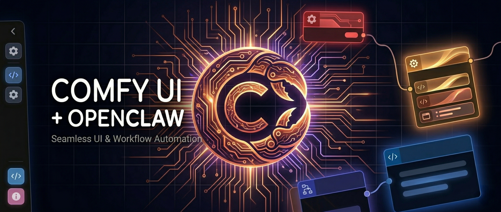

<p align="center">
  
</p>

<p align="center">
  <strong>Run ComfyUI in plain English from your AI agent.</strong><br>
  Image, video, and LoRA workflows — any install, any model, any agent harness.
</p>

<p align="center">
  <a href="LICENSE"></a>
  <a href="https://github.com/Zambav/comfyui-skill-public/stargazers"></a>
  <a href="https://github.com/Zambav/comfyui-skill-public/commits/main"></a>
  <a href="https://github.com/Zambav/comfyui-skill-public/issues"></a>
  
  
  
</p>

<p align="center">
  <a href="#quick-start">Quick start</a> ·
  <a href="#worked-example">Worked example</a> ·
  <a href="#what-you-can-ask">What you can ask</a> ·
  <a href="#why-this-works">Why it works</a> ·
  <a href="#works-with-any-agent">Works with any agent</a> ·
  <a href="#when-to-use-this">When to use</a> ·
  <a href="#repository-structure">Repo structure</a>
</p>

---

## Talk to ComfyUI in natural language

Stop hand-editing JSON workflows. Tell your agent what you want, and it builds the workflow, queues the jobs, watches them run, and reports back.

```text
You:    "batch this entire image folder into cinematic portraits and pick good prompts"
Agent:  "Where are the photos? Where should outputs go? What should I call this batch?"
You:    "/path/to/photos/portraits, /path/to/photos/portraits/cinematic, 'portraits_v1'"
Agent:  "47 images found. Running FLUX 2 image edit, one prompt, randomized seed."
         [.. 47 jobs queued, each one blocks on completion, each one verified with /history ..]
Agent:  "Done. 47/47 OK. Output: /path/to/photos/portraits/cinematic/batch_01/"
```

No JSON editing. No fire-and-forget queueing. No silent failures. Just: describe it, run it, get the files.

---

## Quick start

```bash
# 1. Drop the skill into your agent's environment
git clone https://github.com/Zambav/comfyui-skill-public.git
cd comfyui-skill-public

# 2. Read the right entry point
#    - AI agent       -> AGENTS.md
#    - Human operator -> SKILL.md

# 3. (Optional) Copy the production helper into your project
cp scripts/api_lib.py /path/to/your/project/

# 4. Install runtime dependencies
pip install requests websocket-client pillow
```

Then start issuing ComfyUI tasks to your agent. That's it.

---

## What you can ask

| Trigger | What happens |
|---------|--------------|
| *"batch this folder into images"* | Runs a FLUX 2 image edit batch with the prompt you give it |
| *"generate an image of X"* | Runs a FLUX 2 T2I single-shot generation |
| *"make this a video with a slow push-in"* | Runs an LTX 2.3 I2V (image-to-video) render |
| *"turn this folder into short cinematic clips"* | Runs an LTX 2.3 batch over your image set |
| *"joycaption my image library so we can use it to prompt enhancements"* | Builds scene descriptions, feeds them to an LLM, generates per-image cinematic prompts |
| *"train a LoRA on this dataset"* | Structures the dataset, configures training, applies JoyCaption + dynamic prompting, deploys the checkpoint to ComfyUI |
| *"upscale this entire folder to 4K"* | Runs an ESRGAN or RTX upscale batch |
| *"is the queue stuck?"* | Inspects `/queue` and `/history`, reports, and applies the standard recovery SOP if needed |

Every trigger goes through the same proven execution path (see [Why this works](#why-this-works)).

---

## Worked example

Real session, abbreviated. The agent follows the patterns in `scripts/api_lib.py` and `reference-implementations.md`.

**User:** *"Take everything in /path/to/renders/sci-fi and turn it into a moody cyberpunk cinematic. Use one good prompt. Output to /path/to/renders/sci-fi/cinematic."*

**Agent does, silently:**

```python
# 1. Discover the install
from api_lib import comfyui_is_alive, get_object_info
assert comfyui_is_alive("http://127.0.0.1:8188")
nodes = get_object_info("http://127.0.0.1:8188")
assert "Flux 2 Image edit workflow API.json" or equivalent exists  # confirmed via object_info

# 2. Load + patch the base workflow
from api_lib import load_workflow
import copy
wf = copy.deepcopy(load_workflow("workflows/flux_2_i2i.json"))
wf["6"]["inputs"]["text"]    = "moody cyberpunk cinematic, neon rim light, volumetric fog"
wf["198"]["inputs"]["image"] = copy_to_comfyui_input("/path/to/renders/sci-fi/shot_001.png")
wf["225"]["inputs"]["output_path"] = "/path/to/renders/sci-fi/cinematic/batch_01"

# 3. Queue, block on completion, verify with /history
from api_lib import queue_prompt, wait_for_completion
import uuid, websocket
client_id = str(uuid.uuid4())
ws = websocket.WebSocket()
ws.connect(f"ws://127.0.0.1:8188/ws?clientId={client_id}")
prompt_id = queue_prompt(wf, host="http://127.0.0.1:8188", client_id=client_id)
job = wait_for_completion(prompt_id, ws=ws, host="http://127.0.0.1:8188")
# -> "OK: shot_001.png"  (only after the server confirms success, not just submission)
```

The same loop runs 23 times. The agent reports: *"23/23 OK. Output: /path/to/renders/sci-fi/cinematic/batch_01/"*.

---

## Why this works

This skill is built on a battle-tested execution pattern. Every job — image, video, LoRA — goes through the same loop:

```
load workflow (once) -> deep copy -> patch 3-5 nodes
        |
        v
queue via POST /prompt
        |
        v
BLOCK on WebSocket until ComfyUI says done
        |
        v
VERIFY with GET /history/{prompt_id}
        |
        v
record result -> next job (one persistent WS, one client_id, whole batch)
```

| Anti-pattern this prevents | What we do instead |
|----------------------------|---------------------|
| Fire-and-forget `POST /prompt` — jobs disappear into a shared queue | Block on WebSocket, verify with `/history` per job |
| Editing the base workflow JSON | Always deep-copy and patch; base file untouched |
| Hardcoded paths, model filenames, Discord channel IDs | All runtime values via env vars (`COMFYUI_HOST`, `COMFYUI_WS`, `COMFYUI_INPUT_DIR`) or function args |
| Overwriting previous runs | Date-prefixed `jobs/{PROJECT}/{YYYY-MM-DD}_{batch}/` layout, never reused |
| Skipping `joycaption.md` and regenerating descriptions | Check first, ask the user, never silently overwrite |

---

## Architecture

Two layers, both first-class:

```
+---------------------------------------------------------------+
|  Layer 1: comfy-cli (official lifecycle tool)                 |
|    Setup, server lifecycle, custom nodes, models              |
|    -> comfy install / launch / stop / node / model            |
+-----------------------------+---------------------------------+
                              |
+-----------------------------v---------------------------------+
|  Layer 2: REST + WebSocket API + skill scripts                |
|    Workflow execution, param injection, monitoring, downloads |
|    -> POST /api/prompt, GET /api/view, WS /ws                 |
|    -> scripts/api_lib.py, scripts/template_run_batch.py        |
+---------------------------------------------------------------+
```

The official CLI is excellent for install and lifecycle. The REST/WS API fills in execution, monitoring, and batch orchestration. Each layer has a clean job; the agent picks the right one.

---

## Works with any agent

This skill is **agent-harness agnostic**. It's a set of Markdown docs, Python helpers, and demo workflows — not a binary or a platform plugin. Drop it into any agent that can read files and run Python.

Tested and supported:

| Agent | Notes |
|-------|-------|
| **Hermes / OpenClaw** | Native. The skill was originally authored for this stack. |
| **Claude Code** | Works out of the box. `AGENTS.md` is the read path. |
| **Codex CLI** | Works out of the box. Treat the repo as a skill pack. |
| **Cursor** | Works. Use the project's file tree as the agent context. |
| **Aider, Continue.dev, Cody, custom agents** | Anything that can read files and run `python3 scripts/*.py` works the same way. |

What the agent does, regardless of harness:

1. Read `SKILL.md` to confirm the skill applies.
2. Read the matching `prompting-guides/*.md` for prompt style.
3. Read `reference-implementations.md` for the node map and patch pattern.
4. Run `python3 scripts/api_lib.py` (or import from your own code) to talk to ComfyUI.

No agent-specific API keys, no platform lock-in, no vendor handshake. The skill talks to ComfyUI over plain HTTP and WebSocket.

---

## Bring your own workflows

The `demo-workflows/` folder is **just a starting point** — three example graphs (FLUX 2 image edit, FLUX 2 T2I, LTX 2.3 video) that happen to work on one specific install. They will not match your node set, your model filenames, or your custom nodes.

**The skill works with any ComfyUI workflow you have.** A few of the things the included reference docs cover:

- ✅ Any checkpoint loader (`CheckpointLoaderSimple`, `UNETLoader`, dual-file loaders, community wrappers)
- ✅ Any text encoder / CLIP loader pair
- ✅ Any VAE loader
- ✅ Any image / video / audio output node (`SaveImage`, `ttN imageOutput`, `VHS_VideoCombine`, `SaveVideo`, custom save nodes)
- ✅ Any custom node pack installed on the target machine

**We strongly encourage you to bring your own workflows.** Export any workflow from your ComfyUI in API format (`Menu → Workflow → Export (API)`), then ask your agent:

> "I have a custom ComfyUI workflow at `/path/to/my_workflow.json`. Help me use it through this skill."

The agent will:
1. Read your workflow's API JSON
2. Discover what nodes, models, and encoders it depends on via `/object_info`
3. Add a node map to `reference-implementations.md` (or a new file) describing which nodes to patch per job
4. Wire it into a batch script using the same `scripts/api_lib.py` patterns
5. Hand back a working end-to-end loop

This is the loop the skill is built around: **discover → patch → queue → block → verify**, on any graph, with any model, on any install.

---

## When to use this

**Great fit if you…**

- Run ComfyUI from an AI agent and want clean natural-language control
- Need the same skill to work on local, remote, and cloud ComfyUI installs without rewriting
- Run large batch jobs (overnight, multi-prompt) and need state tracking, recovery, and progress reporting
- Build LoRAs with structured dataset prep + JoyCaption descriptions
- Want a tested reference implementation you can copy or import, not a doc that re-derives the patterns every time

**Skip it if you…**

- Only click around in the ComfyUI web UI — this skill assumes agent-driven or scripted execution
- Need a single-machine, single-workflow tool — for that, a one-off script is faster
- Want a GUI front end — this is an API + skill package, not a UI
- Need a closed-source or proprietary ComfyUI alternative — this is MIT-licensed and assumes stock ComfyUI

---

## What's in this repo

| | | |
|---|---|---|
| ✅ | **Image generation** | FLUX 2 T2I, FLUX 2 I2I/edit |
| ✅ | **Video generation** | LTX 2.3 I2V/T2V, WAN 2.2 (T2V, I2V, Animate), Hunyuan T2V |
| ✅ | **Batch orchestration** | queue-and-watch, state files, watchdog recovery, date-prefixed job folders |
| ✅ | **Cron / monitoring** | Scheduler-agnostic SOP (any cron, systemd, launchd, or OpenClaw), progress templates, error recovery |
| ✅ | **JoyCaption pipeline** | Naming convention, format spec, LLM-driven prompt generation |
| ✅ | **LoRA training** | Dataset structuring, training config, dynamic prompting, checkpoint management, deployment |
| ✅ | **Production helper** | `scripts/api_lib.py` — persistent WS, thread-safe reconnect, env-var config |
| ✅ | **Batch starter** | `scripts/template_run_batch.py` — sanitized, env-driven, ready to fill in |
| ✅ | **AI-agent friendly** | `AGENTS.md` cold-start, intake questionnaire, hard rules |
| ✅ | **Portability** | Zero hardcoded paths, zero machine-specific values, zero personal data |

---

## Common workflows

### FLUX image edit (I2I)

```text
You:    "edit these photos to look cinematic"
Agent:  "What's the prompt? One batch or multiple?"
You:    "warm lighting, film grain, photoreal"
Agent:  runs FLUX 2 image edit batch -> outputs next to source images
```

See [FLUX 2 node map](reference-implementations.md#flux-image-edit--node-map).

### LTX 2.3 video (I2V/T2V)

```text
You:    "make a video of this image with a slow push-in"
Agent:  "What's the prompt? I2V or T2V? What should the output filename be?"
You:    "slow push-in, subject turns to camera, golden hour, scene_01"
Agent:  stages input, queues job, blocks on completion, returns outputs
```

See [LTX 2.3 node map](reference-implementations.md#ltx-23-video--node-map).

### JoyCaption + LLM-driven prompts

```text
You:    "joycaption this folder and generate cinematic prompts for each"
Agent:  checks for existing joycaption.md
        -> if found, asks: use it / update it / start fresh?
        -> if not, runs JoyCaption -> captions.txt -> LLM reads + writes prompts JSON
You:    confirm prompt style
Agent:  queues the batch
```

See [JoyCaption convention](docs/joycaption-convention.md).

### LoRA training

```text
You:    "train a LoRA on this dataset"
Agent:  structures dataset folders, configures training parameters,
        uses JoyCaption for descriptions, applies dynamic prompting,
        manages checkpoint output, deploys to ComfyUI
```

See [models.md](models.md) for the LoRA loading + training pipeline.

---

## Pipeline overview

### LLM-driven prompting pipeline (video)

```
JoyCaption -> captions.txt (raw scene descriptions, never modified)
      |
      v
LLM reads captions.txt + prompting-guides/ltx-2.3-prompting-guide.md
      |
      v
ltx_video_prompts.json (versioned, unique prompt per image)
      |
      v
Batch runner loads JSON -> queues to ComfyUI
```

### LoRA training pipeline

```
Dataset prep -> JoyCaption-assisted descriptions -> dynamic prompting variants
      |
      v
Training config + run -> checkpoint management
      |
      v
Deploy selected checkpoint to ComfyUI
```

---

## Repository structure

```text
comfyui-skill-public/
├── SKILL.md                       # Trigger scope + read path
├── AGENTS.md                      # AI agent cold-start instructions
├── README.md                      # You are here
├── setup.md                       # First-run / unknown install onboarding
├── api.md                         # REST + WebSocket API reference
├── workflow-patterns.md           # Programmatic graph building + validation
├── models.md                      # Family-specific loader / LoRA / training guidance
├── dependencies.md                # ComfyUI + Python packages + JoyCaption
├── batch-operations.md            # Queue-and-watch, state, recovery, intake questionnaire
├── reference-implementations.md   # Node maps (FLUX I2I, FLUX T2I, LTX, WAN, Hunyuan) + code patterns
├── cron-jobs.md                   # Scheduler-agnostic monitoring SOP
├── prompting-guides/
│   ├── README.md
│   ├── general-prompting-guide.md
│   ├── ltx-2.3-prompting-guide.md
│   ├── flux-2-prompting-guide.md
│   └── wan-2.2-prompting-guide.md
├── scripts/
│   ├── api_lib.py                 # Production ComfyUI API helper (persistent WS, reconnect, env-var config)
│   └── template_run_batch.py      # Sanitized batch-run starter script
├── docs/
│   ├── Banner_openclaw.png        # Hero banner (this README's top image)
│   └── joycaption-convention.md   # JoyCaption naming, format, and pipeline convention
├── demo-workflows/                # READ ONLY examples — replace with your own
│   ├── Flux 2 Image edit workflow API/
│   ├── Flux 2 image gen/
│   └── ltx 2.3/
├── changelog.md
├── CONTRIBUTING.md
├── SECURITY.md
├── CODE_OF_CONDUCT.md
└── LICENSE
```

> **Demo workflows are just starting points.** They are tied to one specific ComfyUI install. **We strongly encourage you to bring your own workflows** — see [Bring your own workflows](#bring-your-own-workflows) above for how. [demo-workflows/README.md](demo-workflows/README.md) is the per-example breakdown.

---

## Troubleshooting

| Symptom | First check |
|---------|-------------|
| `class_type not found` error | Confirm the class is in `GET /object_info` on the target install |
| Model / LoRA not found | Verify the exact filename (case-sensitive, includes extension) via `comfy model list` or your install's model dir |
| Run fails mid-graph | Validate family-specific encoder/VAE/scheduler compatibility (see [models.md](models.md)) |
| Batch appears stalled | Inspect `/queue` and `/history`; see [cron-jobs.md](cron-jobs.md) recovery sequence |
| Cloud / remote not responding | Confirm REST and WebSocket reachability; check API key in `COMFYUI_CLOUD_API_KEY` |
| `joycaption.md` missing | Expected if the user has not run JoyCaption yet — create it from the raw descriptions |
| Overwriting previous outputs | You're reusing a `filename_prefix` — every project needs a unique prefix |

---

## Project standards

- Security policy: [SECURITY.md](SECURITY.md)
- Contribution guide: [CONTRIBUTING.md](CONTRIBUTING.md)
- Code of conduct: [CODE_OF_CONDUCT.md](CODE_OF_CONDUCT.md)
- Release history: [changelog.md](changelog.md)

---

## License

MIT — see [LICENSE](LICENSE)
